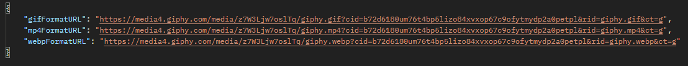

# Gif currency rates dynamic system

---

### Active end point
```
method - GET
address - /api/v1/rates/dynamic/currency?charCode={EUR}
```
_Возвращает объект типа GifImageDto в виде JSON Объекта_

пример обращения  
<http://127.0.0.1:{PORT}/api/v1/rates/dynamic/currency?charCode=RUB> <br/>
<http://127.0.0.1:{PORT}/swagger-ui.html>

```где {PORT} - порт из контейнера или порт приложения```

Готовый docker image можно получить [отсюда](https://hub.docker.com/r/andreydelay/gif-service/tags) 

```docker pull andreydelay/gif-service:latest```

---

### Для запуска приложения необходмо:

Запуск вручную
1. В корне проекта выполнить ./gradlew bootJar 
2. создать необходимые переменные окружения
3. java -jar "PATH_TO_JAR_FILE" (ex. user\IdeaProjects\project_name\build\libs\JAR_NAME.jar)

Запуск с помощью docker комманды
1. В корне проекта выполнить ./gradlew bootJar
2. Сначала нужно запустить команду  [docker build -t tag](https://docs.docker.com/engine/reference/commandline/build/), <br/>
находясь в корне проекта запустить ```docker build .```
3. Следующим шагом будет [запуск docker образа](https://docs.docker.com/engine/reference/commandline/run/) и на нашем примере это будет выглядеть так <br/>
``` 
docker run -d -p 8080:8088 --name anyname 
-e CURRENCY_API_URL=https://openexchangerates.org/api 
-e GIF_API_URL=api.giphy.com/v1/gifs/search 
-e APP_ID=aeafe872a06a4529b38b8226970ef527 
-e API_KEY=oPIMd6yEozhTyom1QrGcgeORY83ygDTU 
IMAGE_NAME/ID
```

Запуск с помощью docker-compose
1. В корне проекта выполнить ./gradlew bootJar  
2. Выполнить команду [docker-compose up -d](https://docs.docker.com/compose/reference/up/)
---
 
### Пример овета приложения 




